<p align="center">
  
</p>

<h1 align="center">Horizon</h1>

<p align="center">
  <strong>A temporal intelligence layer for DreamDEX Event Contracts.</strong><br/>
  Built for the <strong>Somnia × DreamDEX Event Contracts Hackathon</strong>.
</p>

---

## Problem

DreamDEX Event Contracts turn predictions into tradeable markets. But a probability number without context is just noise.

When a trader sees "BTC UP 70% in 1h," they don't know:

- Is conviction **strengthening or weakening**?
- Do short-term and long-term horizons **agree**?
- What will this look like **in 30 minutes**?
- Is this a **pattern** or just **noise**?

Traditional markets have price charts showing movement over time. Event Contracts have **probability snapshots** — isolated numbers with no trajectory, no context, no narrative.

Meanwhile, a trader wanting to act must:

1. Open 5m market, note probability
2. Open 1h market, note probability
3. Open 4h market, note probability
4. Mentally compare them
5. Decide if this is a pattern
6. Leave the analysis page
7. Go to the trading page
8. Re-enter parameters and execute

**This is like trading without a chart.**

---

## Solution

Horizon aggregates multiple rolling Event Contract horizons for the same asset and **interprets the evolution of market conviction as a temporal trajectory** — not just "Up or Down?" but "How does conviction move through time?"

### Temporal Intelligence

- **Trajectory** — how conviction changes from short to long horizons
- **Persistence** — whether direction remains consistent across horizons
- **Conviction Decay** — how much directional probability weakens over time
- **Cross-Horizon Divergence** — disagreement between short and long horizons
- **Market Regime** — the dominant pattern (acceleration, persistence, decay, reversal, conflict)
- **Decision Quality** — composite actionability score (HIGH / MEDIUM / LOW)
- **Forecast Cone** — heuristic 60-minute projection of current trajectory

### Connected to Action

- **Strategy Composer** — Conservative / Balanced / Aggressive recommendations with optional manual direction override
- **Trade Execution** — direct on-chain DreamDEX CLOB execution
- **Position Tracking** — binary positions via `getPortfolio()`
- **Entry Thesis** — capture analysis at entry, monitor for invalidation
- **Settlement Verification** — oracle resolution, claimable positions, redemption

---

## Core Message

> DreamDEX gives you event probabilities.
> **Horizon shows you how conviction moves through time.**

---

## Features

| Category | Feature | Status |
|----------|---------|--------|
| **Discovery** | Event Contract market discovery (5m, 1h, 4h cadences) | ✅ |
| | Real-time orderbook data from DreamDEX CLOB | ✅ |
| | Market lifecycle tracking (Trading → Locked → Resolved) | ✅ |
| **Intelligence** | Multi-horizon probability aggregation | ✅ |
| | Temporal trajectory calculation | ✅ |
| | Market regime classification | ✅ |
| | Probability velocity & conviction decay | ✅ |
| | Cross-horizon divergence detection | ✅ |
| | Actionability scoring | ✅ |
| | MAP THE NEXT HOUR (forecast cone) | ✅ |
| | Deterministic evidence & explanation | ✅ |
| | What Changed breakdown | ✅ |
| **Trading** | Strategy Composer (3 risk profiles) | ✅ |
| | Strategy-specific risk gates (conflict severity, reversal score) | ✅ |
| | Directional expected edge (BUY: fair−entry, SELL: entry−fair) | ✅ |
| | Risk-based position sizing (confidence × edge × liquidity) | ✅ |
| | Dynamic TP/SL (volatility-adjusted) | ✅ |
| | Direction Override (manual UP/DOWN toggle) | ✅ |
| | DreamDEX on-chain execution | ✅ |
| | Trade preview with entry, direction, sizing | ✅ |
| | Orderbook depth visualization | ✅ |
| **Tracking** | Binary positions via `getPortfolio()` | ✅ |
| | Entry thesis capture & monitoring | ✅ |
| | Settlement verification & oracle metadata | ✅ |
| | Claimable position redemption | ✅ |
| | Market replay (snapshot comparison) | ✅ |
| **Social** | Signal follow system | ✅ |
| | Cross-asset comparison | ✅ |
| | Live activity feed | ✅ |
| | Suggested questions for Copilot | ✅ |
| **UX** | Market Workspace (2-column, sticky trade ticket) | ✅ |
| | Event context with YES/NO pricing | ✅ |
| | Terminal-style dark UI | ✅ |
| | Responsive (mobile + desktop) | ✅ |
| | Cold start retry for SDK reliability | ✅ |

---

## Architecture

```mermaid
graph TD
    SDK["DreamDEX SDK<br/><i>listLiveBinaryMarkets</i>"]
    EC{"isValidEventContract()<br/>status=Trading, voided=false<br/>cadence ∈ [5m, 1h, 4h]"}
    CD["Canonical Data<br/><i>MarketData + per-market decimals</i>"]
    TE["Temporal Engine<br/><i>velocity · persistence · decay<br/>divergence · momentum · liquidity</i>"]
    MR["Market Regime<br/><i>bullish/bearish × acceleration/<br/>persistence/decay · reversal<br/>conflict · neutral</i>"]
    FC["Forecast<br/><i>MAP THE NEXT HOUR<br/>7-point heuristic projection<br/>upper/lower bounds · confidence</i>"]
    DC["Decision Context<br/><i>regime · quality · actionability<br/>strategy recommendations</i>"]
    SC["Strategy Composer<br/><i>Conservative / Balanced / Aggressive</i>"]
    OB["Orderbook Panel<br/><i>depth visualization<br/>bids · asks · spread</i>"]
    TP["Trade Preview<br/><i>Direction · Entry · Quantity<br/>Horizon · Max Loss · Payout</i>"]
    EX["Execution<br/><i>placeOrder → receipt → OrderPlaced</i><br/>ON-CHAIN: Somnia Shannon"]
    PS["Position<br/><i>getPortfolio() → binary positions</i>"]
    TH["Thesis<br/><i>Entry snapshot → current comparison</i><br/>STRENGTHENING · WEAKENING<br/>INVALIDATED · RESOLVED"]
    ST["Settlement<br/><i>getMarketResolution → getClaimable → redeem</i><br/>ON-CHAIN: oracle verification"]

    SDK --> EC
    EC -->|valid Event Contract| CD
    CD --> TE
    TE --> MR
    MR --> FC
    MR --> DC
    DC --> SC
    SC --> OB
    OB --> TP
    TP --> EX
    EX --> PS
    PS --> TH
    TH --> ST

    style SDK fill:#f59e0b,stroke:#d97706,color:#000
    style EC fill:#38bdf8,stroke:#0284c7,color:#000
    style CD fill:#111113,stroke:#f59e0b,color:#f59e0b
    style TE fill:#111113,stroke:#f59e0b,color:#f59e0b
    style MR fill:#111113,stroke:#38bdf8,color:#38bdf8
    style FC fill:#111113,stroke:#22c55e,color:#22c55e
    style DC fill:#111113,stroke:#a78bfa,color:#a78bfa
    style SC fill:#111113,stroke:#a78bfa,color:#a78bfa
    style OB fill:#111113,stroke:#38bdf8,color:#38bdf8
    style TP fill:#111113,stroke:#f59e0b,color:#f59e0b
    style EX fill:#f97316,stroke:#ea580c,color:#000
    style PS fill:#111113,stroke:#38bdf8,color:#38bdf8
    style TH fill:#111113,stroke:#eab308,color:#eab308
    style ST fill:#f97316,stroke:#ea580c,color:#000
```



**Legend:**
- **ON-CHAIN** — verified on Somnia Shannon Testnet (chain ID 50312)
- **SERVER** — server-side SDK operations (market discovery, orderbook, execution)
- **CLIENT** — browser-side (wallet connection, charts, UI)

---

## Temporal Engine

The temporal engine computes these metrics from raw orderbook data:

| Metric | Formula | Description |
|--------|---------|-------------|
| **Velocity** | Δ prob / Δ time | Rate of conviction change per hour |
| **Persistence** | Consistent direction ratio | How consistently directional across horizons |
| **Conviction Decay** | longProb − shortProb | How conviction weakens (or strengthens) at longer horizons |
| **Cross-Horizon Divergence** | \|shortAvg − longAvg\| | Disagreement between short and long horizons |
| **Momentum** | avgSecondHalf − avgFirstHalf | Acceleration / deceleration of probability |
| **Direction Strength** | \|avgProb − 0.5\| × 2 | How far from neutral (0.5) |
| **Data Quality** | Composite score | Orderbook depth, spread, time-to-expiry |

### Trajectory Score

Weighted composite:

- 30% direction strength
- 25% momentum
- 20% persistence
- 15% cross-horizon consistency
- 10% liquidity

### Trajectory States

| State | Meaning |
|-------|---------|
| Bullish Acceleration | Probability rising faster at longer horizons |
| Bullish Persistence | Consistent bullish conviction across horizons |
| Bullish Decay | Short-term bullish but weakening at longer horizons |
| Bearish Acceleration | Probability falling faster at longer horizons |
| Bearish Persistence | Consistent bearish conviction across horizons |
| Bearish Decay | Short-term bearish but weakening at longer horizons |
| Reversal Warning | Cross-horizon flip detected |
| Cross-Horizon Conflict | Short and long horizons disagree |
| Neutral | No clear directional bias |
| Single Horizon | Only one horizon available |

---

## Decision Layer

`buildDecisionContext()` produces a unified pipeline output:

- **Regime** — market state classification + strength + duration hint
- **Decision Quality** — composite score (data quality, trajectory, forecast confidence)
- **Actionability** — HIGH / MEDIUM / LOW (determines trade recommendation behavior)
- **Strategies** — 3 profiles with specific entry, direction, sizing, and confidence

### Actionability

Actionability determines whether the system recommends trading:

- **HIGH** — Strong signal, low reversal risk, consistent horizons
- **MEDIUM** — Moderate signal, some uncertainty
- **LOW** — Weak or conflicted signal, conservative profile suppressed

---

## Strategy Engine

Each strategy profile (Conservative / Balanced / Aggressive) has its own risk policy:

| Parameter | Conservative | Balanced | Aggressive |
|-----------|-------------|----------|------------|
| Hard conflict gate | 0.5 | 0.8 | 1.0 |
| Hard reversal gate | 0.3 | 0.6 | 0.9 |
| Min expected edge | 5pp | 2pp | 2pp |
| Size multiplier | 0.5x | 1x | 2x |
| Uncertainty penalty | 0.7 | 0.5 | 0.3 |

### Risk Gates (per-strategy)

Trades are blocked when:
1. **Conflict severity** exceeds `hardConflictGate` — horizons disagree too much
2. **Reversal score** exceeds `hardReversalGate` — strong reversal signal detected
3. **Expected edge** below `minEdge` — not enough edge after costs

### Directional Expected Edge

- **BUY**: `fairProbability − entryPrice` (positive when fair value > entry)
- **SELL**: `entryPrice − fairProbability` (positive when entry > fair value)
- Fair probability = trajectory-adjusted mid (`mid + velocityPerHour × horizonHours`)

### Risk-Based Position Size

```
size = multiplier × edge × confidence × liquidity / uncertainty × MAX_POSITION_SIZE
```

Position size can be 0 — `isExecutable: false` when edge/confidence too low.

### Block Reasons

When a strategy blocks a trade, `blockReason` explains why:
- `"Conflict severity 1.00 exceeds threshold 0.80."`
- `"Reversal score 0.72 exceeds threshold 0.60."`
- `"Expected edge 0.5pp below minimum 2.0pp."`
- `"Position size too small — insufficient edge/confidence for execution."`

---

## Trade Execution

Uses DreamDEX SDK's `placeOrder()` entry point:

1. **Preflight** — validate pool, status, expiry, tick/lot quantization
2. **Simulation** — `simulateContract()` for revert detection
3. **Broadcast** — `sendTransaction()` to Somnia Shannon
4. **Receipt** — wait for tx confirmation
5. **OrderPlaced** — verify order exists on CLOB
6. **OrderFilled** — check if IOC fill occurred

### Hybrid Wallet Mode

- **Browser wallet connected** → trade is signed by user's MetaMask via `exchange.setSigner({ walletClient })`
- **No wallet connected** → server-side demo executor with testnet private key (fallback)

### SELL → BUY_NO Conversion

DreamDEX binary pools use ERC-6909 outcome tokens. `SELL_YES` requires pre-holding YES tokens. Horizon automatically converts bearish trades to **BUY_NO** (tUSDC → NO tokens) for equivalent exposure without requiring YES token inventory:
`SELL_YES @ price ≡ BUY_NO @ (1 - price)`

### Indexer Retry

Portfolio/positions pages include automatic retry with timeout handling for slow Somnia indexer responses (2 retries, 15s timeout per attempt).

> **Demo/Testnet Executor** — transaction is not signed by your connected wallet.
> This is a server-side testnet fallback for hackathon demonstration.

---

## Position + Thesis

**Positions** read from `getPortfolio()` (indexer-based, binary only).

**Entry Thesis** captures at trade execution:
- Market regime, signal strength, confidence, reversal risk
- Velocity, divergence, persistence, data quality

**Thesis Monitor** compares entry vs. current:
- STRENGTHENING — conditions improved
- WEAKENING — conditions degraded
- INVALIDATED — reversal detected + direction flip
- RESOLVED — market resolved

---

## Settlement + Oracle

- `getMarketResolution()` — settlement record
- `getClaimable()` — claimable positions
- `redeem()` / `redeemMany()` — single/batch redemption
- Oracle verification — question ID, resolution answer, winning outcome

Lifecycle: TRADING → LOCKED → SETTLING → RESOLVED → FINALIZED → REDEEMABLE → REDEEMED

---

## Tech Stack

| Layer | Technology |
|-------|-----------|
| Framework | Next.js 16.3 (App Router, webpack) |
| Language | TypeScript |
| Styling | Tailwind CSS v4 |
| UI Components | shadcn/ui |
| Charts | D3.js v7 (temporal trajectory) |
| Charts | Lightweight Charts v5 (market-style) |
| State | TanStack Query v5 |
| Wallet | wagmi v3 + viem 2.x |
| DreamDEX SDK | @somnia-chain/markets-sdk 0.29.0 |
| AI (optional) | Google Gemini (gemini-2.5-flash) |
| Database (optional) | Supabase Postgres |
| Testing | Vitest |
| Network | Somnia Shannon Testnet (Chain ID 50312) |
| Deploy | Vercel |

---

## Local Setup

```bash
# Clone
git clone https://github.com/bayuapriansyah/DreamDex.git
cd DreamDex

# Install
npm install --legacy-peer-deps

# Environment
cp .env.example .env.local
# Fill in DREAMDEX_PRIVATE_KEY with a funded Shannon testnet wallet

# Dev (webpack mode required for SDK compatibility)
npx next dev --webpack
# Opens at http://localhost:3000

# Build
npx next build --webpack

# Tests
npx vitest run
```

---

## Environment Variables

| Variable | Required | Location | Description |
|----------|----------|----------|-------------|
| `DREAMDEX_PRIVATE_KEY` | Yes | Server | Testnet wallet private key (demo executor) |
| `SOMNIA_CHAIN_ID` | Yes | Server | `50312` |
| `SOMNIA_WS_RPC_URL` | Yes | Server | `wss://api.infra.testnet.somnia.network/ws` |
| `SOMNIA_INDEXER_URL` | Yes | Server | `https://dev.smk.somnia.host/v1/graphql` |
| `NEXT_PUBLIC_SUPABASE_URL` | Optional | Public | Supabase project URL |
| `NEXT_PUBLIC_SUPABASE_ANON_KEY` | Optional | Public | Supabase anon key |
| `GEMINI_API_KEY` | Optional | Server | Google Gemini API key for AI explanation |
| `GEMINI_MODEL` | Optional | Server | AI model (default: `gemini-2.5-flash`) |
| `NEXT_PUBLIC_APP_URL` | Optional | Public | Production app URL |

**Security:** Private keys are server-side only. Never put secrets in `NEXT_PUBLIC_*` variables.

---

## Test Results

```
✓ 232/232 tests pass (10 test files)
  - formatting.test.ts
  - normalization.test.ts
  - forecast.test.ts
  - decision.test.ts
  - strategy.test.ts
  - execution.test.ts
  - settlement.test.ts
  - position.test.ts
  - following.test.ts
  - signal-engine.test.ts

✓ TypeScript: 0 errors
✓ Production build: successful (webpack)
```

---

## Known Limitations

1. **Testnet-only** — All execution uses Somnia Shannon Testnet (Chain ID 50312). No mainnet deployment.
2. **Demo executor** — Server-side private key signs transactions. Not user-wallet signing.
3. **Event Contract cadences** — Currently supports 5m, 1h, and 4h horizons (verified on Shannon testnet). 24h excluded (too long for demo).
4. **No MetaMask signing** — Browser wallet signing is architecture-ready but not yet implemented for Event Contracts.
5. **AI explanations optional** — Deterministic analysis works without AI. AI layer requires Google Gemini API key.
6. **Somnia testnet may be degraded** — RPC and binary market pools may be temporarily unavailable. SDK includes cold start retry logic.
7. **Market lifecycle** — Event Contracts expire. When all horizons for an asset expire, the page shows "Insufficient Data" until new markets are listed.

---

## Hackathon

**Competition:** Somnia × DreamDEX Event Contracts Hackathon
**Prize Pool:** $5,000
**Network:** Somnia Shannon Testnet (Chain ID 50312)
**SDK:** @somnia-chain/markets-sdk 0.29.0

### Judging Criteria Alignment

| Criterion | Weight | Our Approach |
|-----------|--------|-------------|
| Innovation | 20% | Temporal intelligence layer — the first tool to show how Event Contract conviction evolves across time horizons |
| Technical Implementation | 25% | Real SDK integration, on-chain execution, deterministic analytics pipeline, 232 tests |
| UX | 20% | Market Workspace with sticky trade ticket, orderbook, event context, terminal-style dark UI |
| Business/Ecosystem Impact | 20% | Adds a decision-support layer DreamDEX currently lacks — makes Event Contracts more usable for active traders |
| Presentation/Demo | 15% | Real testnet data, real execution, clear narrative: "DreamDEX gives you a number. Horizon gives you the trajectory." |

---

<p align="center">
  <strong>MIT License © 2026 Horizon</strong>
</p>
